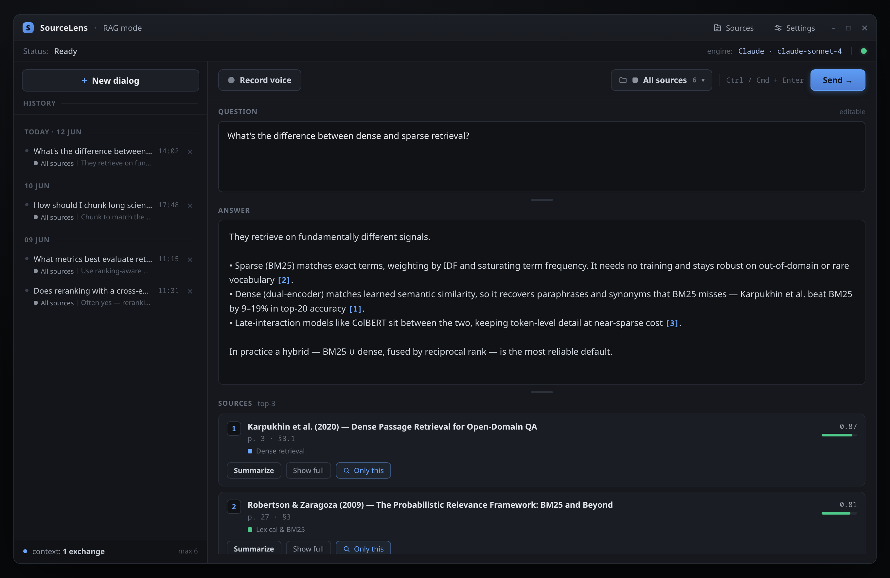

# SourceLens

**Chat with your own books and documents.** A free desktop app (Windows/Linux, and macOS via a
manual build) that builds a
personal library from your PDF, EPUB and text files and answers questions about them in plain
language — typed or by voice. Every answer is backed by quotes from your documents, so you always
see where the information came from. Made for students, researchers and anyone with a lot to read.


-blue)




<p align="center"><em>Ask in plain language; get an answer grounded in your own library, with the exact passages it used.</em></p>

## What it can do

- **Your personal library** — add `.pdf`, `.epub`, `.txt`, `.md` files from the app; they're indexed
  locally, with no size limits and no uploads.
- **Questions in plain language** — type or speak your question (voice is transcribed locally with Whisper).
- **Answers with receipts** — every answer comes with the exact source passages, relevance scores,
  one-click summaries and full-text view.
- **Organize and focus** — group sources into colored collections and scope a question to your whole
  library, a collection, a few documents, or a single source.
- **A real conversation** — follow-up questions keep the context (and use it to sharpen the search);
  the full history is saved and browsable after a restart.
- **Choice of AI** — answers are generated by **Claude** or **Codex**; switch engine and model in Settings.

## Getting started (no programming required)

1. **Download** the latest build from the [Releases page](../../releases) — self-contained, nothing
   else to install:
   - **Windows:** `SourceLens-…-win-x64.zip` → run `SourceLens.exe`.
   - **Linux:** `SourceLens-…-linux-x64.tar.gz` → run `./SourceLens`.
   - **macOS:** no prebuilt release — build it yourself from source (see
     [For developers](#for-developers); it's one `dotnet publish` command).
2. **Install an AI assistant.** SourceLens runs one you already use via your existing sign-in — it
   never asks for or stores API keys. Set up at least one:
   - **Claude Code** (`claude`) — [setup](https://docs.anthropic.com/en/docs/claude-code/setup)
   - **OpenAI Codex CLI** (`codex`) — [setup](https://github.com/openai/codex)

   *Optional (Linux only):* install **ffmpeg** for voice input. Windows records out of the box.
3. **First launch** downloads two local helper models (~600 MB, once): a search model and a
   speech-recognition model. After that everything but the AI answers runs offline.

**Privacy:** documents are indexed and searched on your computer, and voice is transcribed locally.
Only your question and the few passages selected as relevant are sent to the AI engine you chose.

---

## For developers

### Build & test

```bash
cd SourceLens
dotnet build src/SourceLens.sln
dotnet run --project src/SourceLens/SourceLens.csproj

dotnet test src/SourceLens.Tests/SourceLens.Tests.csproj            # unit + headless UI tests
# integration tests (download models / probe real CLIs), run explicitly:
dotnet test src/SourceLens.Tests/SourceLens.Tests.csproj --filter "Category=Integration"
# end-to-end RAG pipeline (real SQLite + real ONNX embedder):
dotnet test src/SourceLens.Tests/SourceLens.Tests.csproj --filter "FullyQualifiedName~EndToEndTests"
```

Releases are built automatically by GitHub Actions on every push to `main`
(`.github/workflows/dotnet-desktop.yml`): tests, then self-contained `win-x64`/`linux-x64` publishes
attached to a GitHub Release.

**macOS** is supported but has no prebuilt release — build it yourself from source with a self-contained
publish for the right runtime identifier (`osx-x64` for Intel, `osx-arm64` for Apple Silicon):

```bash
dotnet publish src/SourceLens/SourceLens.csproj -c Release -r osx-arm64 --self-contained
```

The published app appears under `src/SourceLens/bin/Release/net9.0/osx-arm64/publish/`. ffmpeg is needed
for voice input (`brew install ffmpeg`).

### How it works

Documents are chunked and embedded locally with the `multilingual-e5-small` ONNX model; vectors are
stored in SQLite (`sourcelens.db` next to the binary). At question time the top-K passages by cosine
similarity are injected into the prompt of a CLI agent (Claude/Codex CLI), which produces the answer.
Voice input is ffmpeg/NAudio recording + whisper.cpp (Whisper.net) transcription. Dialog history with
source snapshots is persisted in the same database.

Files created at runtime next to the binary: `sourcelens.db` (index + history + settings), `models/`,
`books/` (the library; UI-added files are copied here, deduplicated by SHA-256, and the folder is
scanned recursively on startup), `logs/`.

### Configuration (`appsettings.json`)

`appsettings.template.json` is copied to `appsettings.json` next to the binary on first start (the
working copy is gitignored). Invalid configuration is reported in a startup error window and in
`logs/Error.log`.

| Section | Keys | Notes |
|---|---|---|
| `AiModel` | `Provider` (`Claude`/`Codex`/`Disabled`), per-engine `BinaryPath`, `ExtraArgs`, `DefaultModel`, `TimeoutSeconds` | Initial defaults only; in-app Settings (stored in the database) take priority. Available models are discovered from the CLI at runtime. |
| `Rag` | `Enabled`, `BooksFolder`, `TopK`, `MinQueryLength`, `ChunkerVersion`, `ChunkSize`, `ChunkOverlap`, `HistoryDepth`, `MaxHistoryChars`, `EmbeddingProvider`, `LocalOnnx{ModelIdLabel,Dimensions,MaxSequenceLength}` | `HistoryDepth=0` disables dialog context (history is still saved). Changing `ChunkerVersion`/embedder settings triggers reindexing. |
| `Transcription` | `Model` (`Tiny`/`Base`/`Small`/`Medium`/`Large`), `Language` (`auto`), `UseGpu`, `Threads`, `PoolSize` | CPU by default. |
| `Audio` | `SourceName`, `Rate`, `Channels`, `BitsPerSample` | `SourceName` is a PulseAudio source on Linux (`default` works). |

### Repository layout

```
.github/workflows/dotnet-desktop.yml  CI: tests + self-contained win-x64/linux-x64 builds → GitHub Release (main only)
src/SourceLens.sln
  SourceLens/               Avalonia UI (RagWindow, SettingsWindow, SourceLibraryWindow) + composition root (App.axaml.cs)
  SourceLens.Domain/        entities (EF Core/SQLite), RAG core (chunker/ingest), RagDialogManager, SourceLibraryManager,
                            LlmContext/PromptCatalog (embedded prompt resources), engine manager, audio abstractions
  SourceLens.Integrations/  Claude/Codex CLI clients, ONNX embedder, SQLite retriever, document loaders,
                            Whisper transcription, recorders, model downloader
  SourceLens.Tests/         NUnit: unit, headless UI (Avalonia.Headless), integration (explicit)
```
